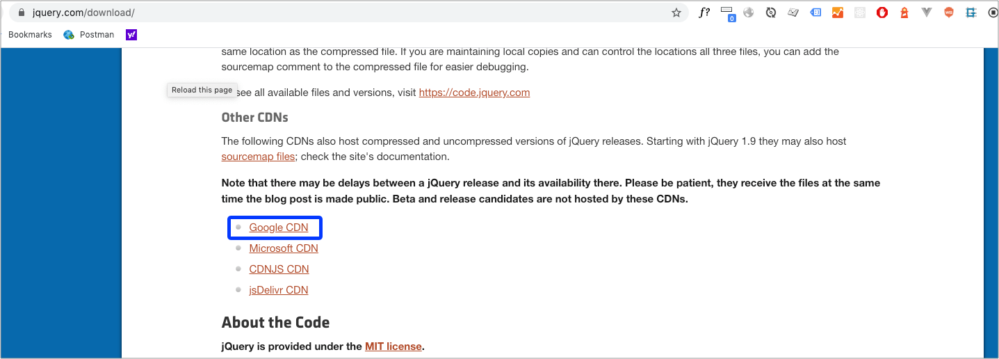
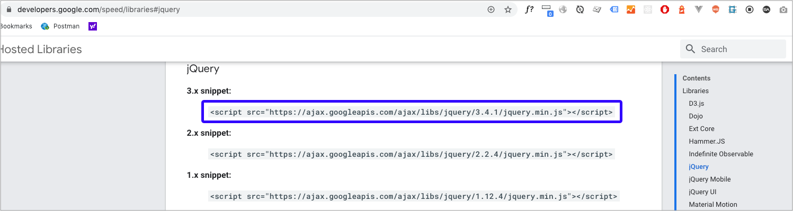
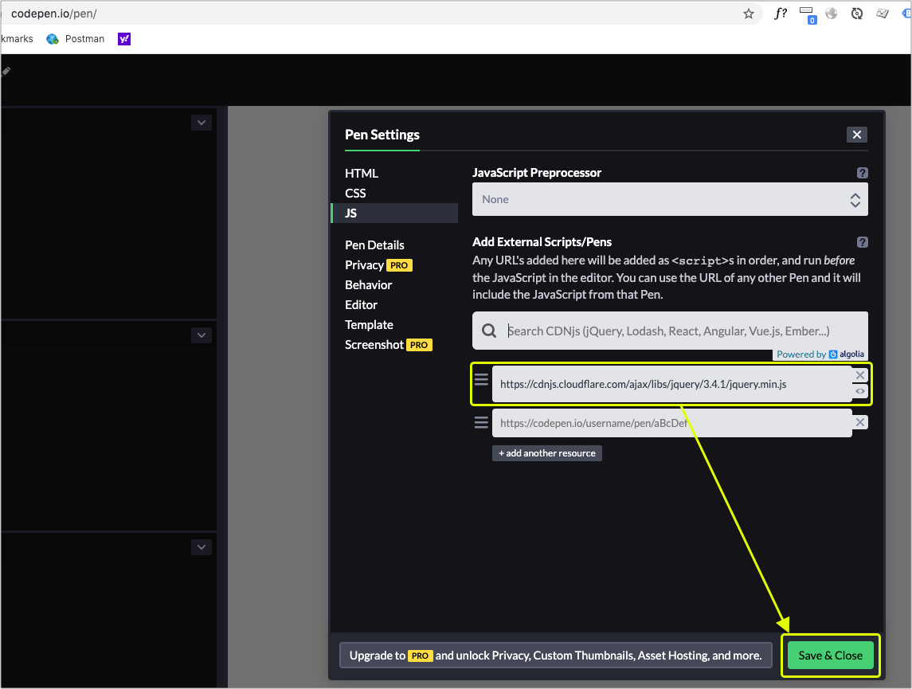

# 2.1 安裝 jQuery

## 方式一：自行下載安裝

點進去[官網網址](https://jquery.com/)後，如下圖，看到「Download jQuery」按鈕，點進去。

<figure><figcaption></figcaption></figure>


在 **`jquery/practice/vendors/jquery/`** 資料夾中，建立檔名 **`jquery-4.0.0.min.js`** ，然後將原始碼全部複製，貼進剛建立的檔案並儲存。

然後在頁面上載入，開啟 `jquery/practice/index2.html` 檔案，改成如下(載入 jQuery 檔案，放在 **`</body>`** 之前)：

```markup
<!doctype html>
<html lang="zh-Hant">
  <head>
    <meta charset="utf-8">
    <title>jQuery 相關練習</title>
  </head>
  <body>
    
    <script src="./vendors/jquery/jquery-4.0.0.min.js"></script>
  </body>
</html>
```

在該頁面就可以使用 jQuery 函式庫了。


## 方式二：使用 CDN

在[下載頁面](https://jquery.com/download/)當中，找到「Google CDN」的連結，如下畫面：



然後點擊進去，複製下圖圈選起來的 script 標籤原始碼：



即：

```markup
<script src="https://ajax.googleapis.com/ajax/libs/jquery/3.7.1/jquery.min.js"></script>
```

將上述 script 標籤，放到你要載入的頁面即可，建議放在 `</body>` 之前。


## 方式三：在 CodePen 上安裝

直接按 `Settings → JS`，搜尋 `jquery`，選擇正確的版本，再按 `Save & Close` 即可。如下示意：



