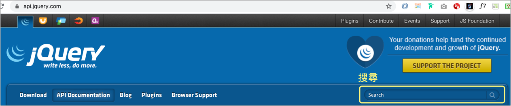

# 1.4 簡介 jQuery 及前置

## jQeury 官網

網址：[https://jquery.com/](https://jquery.com/)

## jQuery 是什麼

是一個 JavaScript 「函式庫(Library)」，執行於瀏覽器端。


## jQuery 最新版本

截至 2025/10，最新版本為 `3.7.1`。


## jQuery API 文件中的搜尋

網址：[https://api.jquery.com/](https://api.jquery.com/)



請透過以上的「搜尋」，試著查看看以下三個 API 的說明：

* width()
* innerWidth()
* outerWidth()

範例觀察：



## 前置

先在電腦桌面(或其它習慣的位置)建立一個 `jquery` 資料夾，然後在該資料夾內，再建立以下資料夾及檔案：

* `assignment/`
* `practice/vendors/jquery/`
* `practice/index2.html`

`index2.html` 檔案內容如下：

```markup
<!DOCTYPE html>
<html lang="en">
  <head>
    <meta charset="UTF-8">
    <meta name="viewport" content="width=device-width, initial-scale=1.0">
    <title>Document</title>
  </head>
  <body>
    
  </body>
</html>
```

之後的練習都會在 `jquery/practice/` 資料夾內。

之後的作業會在 `jquery/assignment/` 資料夾內。

